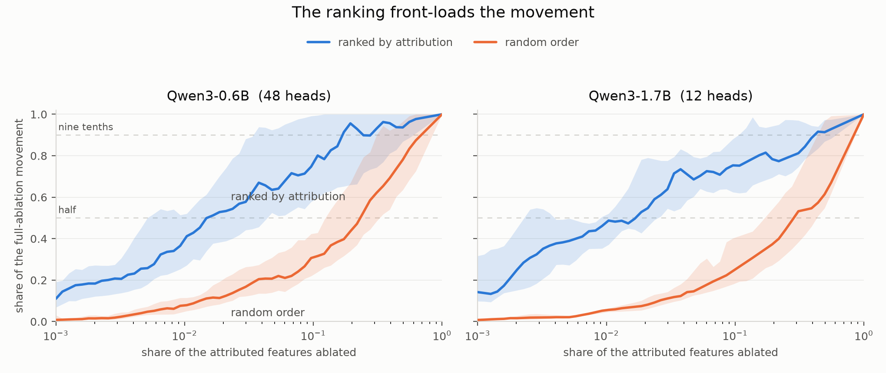

# QK Attribution

Explaining *why* language models attend where they do, by decomposing attention scores into
interactions between query-side and key-side features.

## The problem

Attribution graphs, as implemented in
[circuit-tracer](https://github.com/decoderesearch/circuit-tracer), freeze attention patterns and
treat them as constants. A graph therefore shows where information flows through attention via the
OV pathway, but says nothing about why the model attended to those positions. The QK pathway is
invisible.

Anthropic described a method that closes this gap in
[Tracing Attention Computation Through Feature Interactions](https://transformer-circuits.pub/2025/attention-qk/index.html),
calling QK attributions "a significant qualitative improvement on the original attribution graphs".
[Issue #53](https://github.com/decoderesearch/circuit-tracer/issues/53) requested it upstream and it
remains unimplemented there.

## What this does

Two things, with different maturity.

**Head loadings** split an existing graph edge across the attention heads that carried it. This is
finished and independent of architecture. Propagating a source feature's decoder direction forward
through frozen attention and reading it with the target's encoder reproduces the adjacency entries
circuit-tracer computes by an entirely different route, with no normalisation constant between them
(median ratio 1.0064 over 40 edges; exactly 1.0000 when dtypes match). Splitting that across one
layer's heads is exact to 2.5e-07.

**QK attribution** decomposes an attention score into query-side by key-side feature terms. The
decomposition is exact, and its numbers predict interventions exactly: delete a feature from the
residual stream and the score moves by the attributed amount, correlation 1.000000 across all 263
heads tested on two models and four prompts. The features it names fire on the token they point at
in 79.4% of 412 head cases against a 10.2% control. Ablating the top-ranked features moves the
attention distribution two to ten times further than removing the same number from the same
positions, in about 90% of cases.

Read the ranking rather than the single top pair: removing the top feature shifts how a head
distributes attention, but it changes attention to the one position it names more than a
same-position competitor only 61% of the time.

Two caveats sit on top of that. Feature terms account for 8% to 21% of the score with the low-L0
transcoders published for Qwen3-0.6B, rising to 63% with the higher-L0 set for Qwen3-4B. And the
exactness holds only while the normalisation scales are frozen, as attribution graphs freeze them:
let RMSNorm respond and the same prediction correlates at 0.17 to 0.54 instead of 1.0.

## The form that actually holds

`W_Q @ W_K.T` is not the score operator for a modern model. On Qwen3-0.6B its median relative error
against the model's own scores is 1.175, worse than predicting zero, because rotary embeddings and
QK-normalisation both intervene. What does hold is

    s(p, j) = x_p @ [W_Q diag(w_q) R(p) R(j).T diag(w_k) W_K.T] @ x_j
              / (attn_scale * sigma_q[p] * sigma_k[j])

The QK-norm gains fold into the projections, the rotary operator depends on the position offset
rather than being one matrix, and the RMS scales are per-position scalars frozen the way
circuit-tracer already freezes layernorm scales. This reproduces the model to 2.5e-07 median across
all 448 (layer, head) pairs. Gemma-2's attention-score soft-capping does not reduce this way and is
refused rather than approximated.

## What has been measured

| Question | Answer | Where |
|---|---|---|
| Is the plain QK form usable? | No. Median error 1.175; correlation under 0.5 for 395 of 448 heads | `experiments/003` |
| Does the corrected form hold? | Yes, to 2.5e-07 median | `experiments/003` |
| Is the decomposition exhaustive? | Yes, to 3e-07 with the remainder carried | `experiments/005` |
| How much do features explain? | 8% to 21% of the score norm | `experiments/005` |
| Is there low-rank structure to exploit? | About a factor of two, not an order of magnitude | `experiments/004`, `006` |
| Do head loadings match upstream? | Yes, median ratio 1.0064 | `experiments/007` |
| Does the output read as anything? | Key side yes, query side not with low-L0 transcoders | `experiments/008` |
| Does it hold on other models? | Yes; feature share reaches 63% on 4B high-L0 transcoders | `experiments/009` |
| Do explanations point at the right token? | 79.4% of 412 head cases, against a 10.2% control | `experiments/010` |
| Do the numbers predict interventions? | Exactly: 263/263 heads, correlation 1.000000 | `experiments/011` |
| Is one feature the cause of one edge? | Only 61% of the time; the ranking is the useful part | `experiments/011` |
| Does the ranking predict the pattern? | Yes: 2 to 10 times a matched control, in ~90% of cases | `experiments/012` |
| How long is an explanation? | 25 features for half the movement, 197 for 90% | `experiments/013` |
| Does the upstream port agree? | Yes: median ratio 0.9968, partition error 8.3e-06 | `experiments/014` |

Every number here came from a run whose script, config and raw output are in `experiments/`.

<picture>
  <source media="(prefers-color-scheme: dark)" srcset="experiments/figures/013-saturation-dark.png">
  
</picture>

Ablating the top-ranked features against ablating the same number at random, over 60 head-curves.
Half the movement the attributed features can produce comes from about 1.5% of them.

## Modules

| Module | Responsibility |
|---|---|
| `circuits` | Per-head QK and OV weight products, architecture detection, effective rank |
| `scores` | Exact score reconstruction; rotary operators; frozen QK-norm scales |
| `features` | Reading source directions out of a circuit-tracer graph |
| `attribution` | The feature-pair contraction and its remainder accounting |
| `propagate` | Forward propagation through frozen attention |
| `loadings` | Splitting an edge across one layer's heads, or every layer on its path in one sweep |
| `labels` | Feature descriptions, fetched by byte range from the transcoder repository |
| `nodes` | Adjacency index arithmetic |

## Scope

Decomposition runs for one query position and one head at a time. Over all position pairs the
contraction reaches 1.5 PFLOP per head at 512 tokens and the intermediate does not fit in memory;
the arithmetic is in `experiments/004`. Attributing the part of the residual that transcoder
features do not cover, which is most of it, would mean tracing back through earlier attention and is
not implemented.

## Installation

    uv venv --python 3.10 .venv
    . .venv/bin/activate
    uv pip install -e ".[dev]"

Transcoder weights and gated model weights come from Hugging Face, so `hf auth login` is required.

## Checks

Upstream circuit-tracer requires all of these to pass before a PR:

    pytest
    ruff check
    ruff format --check
    pyright

Tests that need a GPU and downloaded weights are marked `gpu` and `slow` and are deselected by
default. Run them with `pytest -m "gpu and slow"`.

## Licence

MIT, matching upstream.
