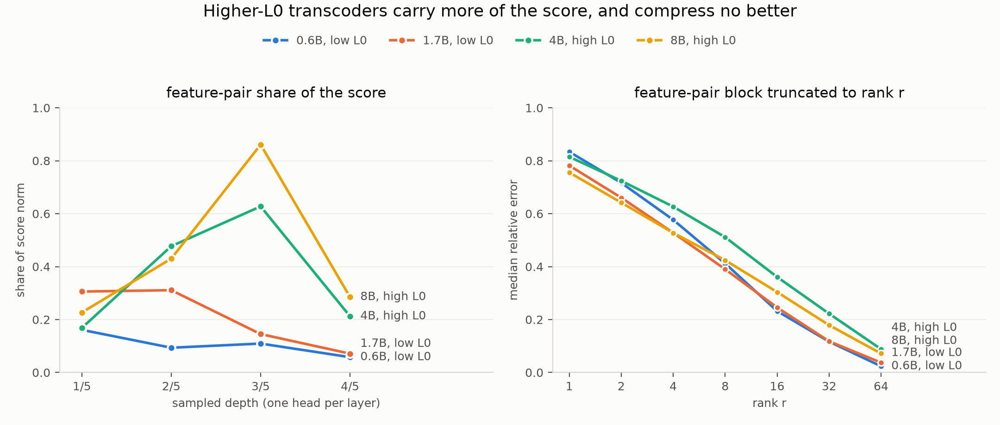

# 009: the same measurements on four models, and what moves the feature share

Date: 2026-09-13
Machines: worker-1 and worker-2, RTX 4090 each
Scripts: `experiments/scripts/run_pipeline.sh` over `measure_completeness`, `measure_feature_rank`,
`measure_edge_loadings` and `explain_attention`
Raw output: `experiments/results/009-qwen3-{0.6b,1.7b,4b,8b}-*.json`
Config: seed 0, the prompt `The capital of the state containing Dallas is`, query position 8, one
graph per model generated with that model's own transcoders. Four layers sampled at one, two, three
and four fifths of the depth (layers 6, 11, 17, 22 of 28 on 0.6B and 1.7B; 7, 14, 22, 29 of 36 on
4B and 8B), so the models are compared at matching relative depth. Feature directions extracted in
float32 throughout. Models in float32 except Qwen3-4B and Qwen3-8B, which are bfloat16 because
float32 weights plus their transcoders do not fit on a 24 GB card.

## Question

Experiments 005 to 008 all rest on Qwen3-0.6B with the only transcoder set published for it, which
is low-L0 and whose features account for 8% to 21% of the attention score. Does that hold on other
models, and does a higher-L0 set change it?

## What could and could not be arranged

Matched low-L0 and high-L0 sets for the same model exist only for Qwen3-14B, at 125 GiB each. That
exceeds both the free disk and, by a wide margin, a 24 GB card. Qwen3-0.6B and 1.7B have only
low-L0 sets; 4B and 8B have only the higher-L0 set.

So the design is four points in two pairs: 0.6B and 1.7B at low L0, 4B and 8B at high L0. Within a
pair, size moves and the L0 regime does not. Between the pairs, size and transcoder set move
together, and nothing here separates them.

## Head loadings replicate

| Model | edge / effect ratio | std | partition error | top head's share | busiest layer's share |
|---|---|---|---|---|---|
| 0.6B | 1.0064 | 0.022 | 2.5e-07 | 0.598 | 0.221 |
| 1.7B | 0.9976 | 0.015 | 1.1e-07 | 0.630 | 0.416 |
| 4B | 0.9776 | 0.023 | 5.8e-03 | 0.766 | 0.461 |
| 8B | 1.0068 | 0.022 | 4.0e-03 | 0.621 | 0.506 |

Medians over 40 edges per model, except std. Agreement with circuit-tracer's own adjacency holds
on all four, within 2.3% of unity. At the carrier layer one head carries 60% to 77% of the routed
magnitude on every model. The 4B and 8B partition errors come from their bfloat16 weights, as the
precision section below shows for 4B.

## The feature share rises with model size and transcoder set

<picture>
  <source media="(prefers-color-scheme: dark)" srcset="figures/009-models-dark.png">
  
</picture>

Both tables below as lines, drawn by `experiments/scripts/plot_models.py`.

Feature-feature share of the score norm, one head per sampled layer:

| Model | L0 | 1/5 depth | 2/5 | 3/5 | 4/5 |
|---|---|---|---|---|---|
| 0.6B | low | 0.161 | 0.094 | 0.109 | 0.058 |
| 1.7B | low | 0.306 | 0.311 | 0.145 | 0.071 |
| 4B | high | 0.168 | 0.477 | 0.627 | 0.212 |
| 8B | high | 0.227 | 0.430 | 0.861 | 0.285 |

At three fifths of the depth the 8B features carry 86% of the score and the 4B features 63%,
against 11% for 0.6B. The interpretable part of the decomposition is the majority at that layer on
8B, which is a different situation from the one experiment 005 described.

Each pair isolates size at a fixed L0 regime. Going from 0.6B to 1.7B doubles or triples the share at
the two shallower layers. Going from 4B to 8B raises it at three of the four layers and lowers it at
one (0.477 to 0.430). Size contributes, then, in both regimes. The jump between the pairs is larger
than either within-pair step, which points at the transcoder set, but this design cannot isolate
it. Each cell is one head on one prompt, so single cells should not be leaned on.

Depth behaves differently in the two regimes. With the low-L0 sets the deepest sampled layer has the
lowest share. With the high-L0 sets the share peaks at three fifths and the shallowest layer has the
lowest share on both 4B and 8B.

## Low-rank structure is worth about a factor of two on every model

Median relative error of the feature-pair block's own optimal rank-r approximation, and the share of
magnitude in the largest pairs:

| Model | rank 16 | rank 32 | rank 64 | top 0.1% | top 1% | top 10% |
|---|---|---|---|---|---|---|
| 0.6B | 0.231 | 0.116 | 0.023 | 0.087 | 0.280 | 0.728 |
| 1.7B | 0.245 | 0.116 | 0.036 | 0.123 | 0.342 | 0.724 |
| 4B | 0.361 | 0.222 | 0.088 | 0.083 | 0.274 | 0.686 |
| 8B | 0.303 | 0.179 | 0.072 | 0.089 | 0.272 | 0.661 |

Blocks too small for a given rank are left out of that column: on 0.6B, rank 32 and 64 cover 48 of
64 blocks, and on 1.7B rank 64 covers 48.

The high-L0 blocks are harder to truncate than the low-L0 ones. Within the high-L0 pair, 8B is
slightly easier than 4B, so the harder 4B result is not the start of a trend with size. The
conclusion from experiments 004 and 006 stands on all four models: this structure is worth about a
factor of two, not an order of magnitude.

*Correction, 2026-09-13.* An audit recomputed this table from the JSON on disk. The earlier version
had 0.232, 0.117, 0.024, 0.088, 0.287, 0.735 for 0.6B, 0.246, 0.118, 0.037, 0.124, 0.343, 0.726
for 1.7B and 0.688 for the 4B top 10%. Those values could not be reproduced from any saved result
and have been replaced. The largest change is 0.007 and no conclusion depended on it.

## Precision is a dtype artifact, and it was measured rather than assumed

The 4B and 8B runs report reconstruction errors of 2e-02 to 8e-02, where 0.6B and 1.7B report
around 4e-07. Two controlled comparisons locate that.

Extracting feature directions in bfloat16 rather than float32, with everything else fixed, moved the
1.7B reconstruction error from 4e-07 to between 2e-02 and 1e-01. The contraction sums millions of
terms that largely cancel, and bfloat16 does not have the headroom. Directions are now always
extracted in float32; the transcoder weights themselves stay in whatever dtype they were loaded as,
because those are what consume memory.

With that fixed, running Qwen3-4B layer 7 head 24 twice, changing only the model dtype:

| Model dtype | reconstruction error | feature-feature share |
|---|---|---|
| float32 | 3.10e-07 | 14.0% |
| bfloat16 | 3.44e-02 | 13.9% |

So the remaining 4B error is its weights, and the shares reported above are barely affected by it.
The same control was not run on 8B, whose float32 weights alone exceed 24 GB; its shares rest on
the 4B result carrying over. The split of the contraction into its four blocks is exact to below
1e-06 on 8B, since that part runs on float32 directions.

## Reading the explanations

The 1.7B explanation is the most legible one this project has produced. At layer 21 head 2,
attending from the final token, the largest key-side terms include a Texas feature
(`L19#52741`, fires on `' Tex' ' Worth' ' Texas'`) at the token `' Dallas'`, and a city feature
(`L20#10464`, fires on `' City' ' Atlanta' ' Tokyo'`) at the same position. For a prompt asking
which state contains Dallas, that is the right reason to look there.

The high-L0 explanations are worse. On 4B the top terms sit on `' the'` with features that do not
read as anything. On 8B the pipeline picked layer 27 head 14, which puts 0.402 of its attention on
content tokens against a median of 0.096 across heads. It attends to `<|im_end|>` (0.441), `' is'`
(0.157), `' capital'` (0.115), `' containing'` (0.090) and `' Dallas'` (0.074). Features cover 13.4%
of this head's score, and all six of its largest feature pairs again sit at the key token `' the'`,
with key features whose top activations are `' '`, `'1'` and `'such'`. Higher feature share on some
heads did not buy a more readable story on this prompt, on either high-L0 model.

## Two bugs this comparison exposed

`activation_values` is aligned with `active_features`, not with `selected_features`. On the 0.6B
graph the two coincide at 3165 entries and the error is invisible. On the 4B graph there are 25758
active and 7500 selected, and indexing the wrong one attaches one feature's activation to another
feature's direction. It showed up as edge / effect ratios with a median of 318 and a maximum of
5.5e9. There is now a regression test on a graph where selection prunes.

`feature_sources` read decoder rows one at a time. With lazily loaded transcoders each read can
re-open the layer's file, so a graph with 25758 features took over forty minutes and had not
finished. Gathering per layer takes it under four minutes.

## Next

- Repeat on a second prompt, since every qualitative claim here rests on one
- Sample more than one head per layer before reading anything into a single cell of the share table
